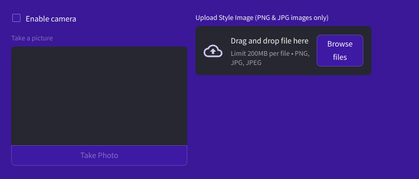

# StyleMotion Streamlit interface

## Table of contents

- [StyleMotion Streamlit interface](#stylemotion-streamlit-interface)
  - [Table of contents](#table-of-contents)
  - [Prerequisites](#prerequisites)
    - [Installations](#installations)
    - [Cloning the repository](#cloning-the-repository)
  - [Setup instructions](#setup-instructions)
  - [Introduction](#introduction)
  - [Tabs](#tabs)
  - [Code](#code)
  - [The Model creation code](#the-model-creation-code)
  - [Selectable models](#selectable-models)
    - [AdaIN Model (StyleMotion)](#adain-model-stylemotion)
    - [Gatys et al. Model](#gatys-et-al-model)
    - [Johnson et al. Model](#johnson-et-al-model)
  - [Huang et al. Model](#huang-et-al-model)
  - [Modes](#modes)
    - [Image](#image)
    - [Video](#video)
    - [Camera](#camera)
    - [Webcam](#webcam)
- [References](#references)

## Prerequisites

Note this application was primarily tested in Windows, meaning that MacOS and Linux operations may work differently.

### Installations

1. Python 3.11 Download and install from python.org. This can be verify with 'python --version'. [Python Official Website](https://www.python.org/)
2. pip (Python package manager), which comes with Python 3.11. This can be verify with 'pip --version'.
3. run 'pip install virtualenv' in a terminal to install the 'virtualenv' library to able to create a virtual environment.

### Cloning the repository

1. `git clone https://github.com/Averagenormaljoe/Neural-Style-Transfer`
2. `cd Neural-Style-Transfer`

## Setup instructions

1. Setup a virtual environment using: python -m venv venv

2. activate the environment with:

'venv\Scripts\activate' (Windows) or 'source venv\Scripts\activate' (MacOS and Linux).

'source venv/Scripts/activate' (Win&Bash).

3. Install the libraries using:

'pip install --force-reinstall setuptools==49.1.2'

'pip install -r requirements.txt'

4. Use 'pip list' to ensure that the packages were correctly installed

5. To start streamlit project, run in the terminal:

'streamlit run app.py'

6. Use the application

7. To deactivate the environment run:

'deactivate'

## Introduction

This is the Github repository for the front-end code of the StyleMotion application. This aims to use the models from the training directory and load them into Streamlit to be used. Streamlit only acts an interface to
manage the models, to allow it tested by other users without requiring a machine.

Models for the johnson model are stored in the 'style_models' directory.

The main StyleMotion model (AdaIN) is stored in the 'main_model' directory.

The Ruber model is stored in the 'Ruber' directory.

The Gatys model is managed as a script due to its being an optimization loop.

You can visit the website, which is running from this link:

[https://stylemotion-app.streamlit.app/](https://stylemotion-app.streamlit.app/).

Note if the project is asleep due to inactivity, press the 'Yes, get this app back up!' button to
restart it.

## Tabs

The tabs directory contains the interface for each of the models.

## Code

The page_config.py file is used for

## The Model creation code

The code for creating the models is stored in another GitHub repository called:
[https://github.com/Averagenormaljoe/Neural-Style-Transfer](https://github.com/Averagenormaljoe/Neural-Style-Transfer)

## Selectable models

### AdaIN Model (StyleMotion)

This is the StyleMotion model is the main model for the report and default recommended model for general usage.
It supports multi neural style transfer, video, real-time. This is based on the AdaIN paper.

### Gatys et al. Model

This model trades speed for sylizatoin quality. Note that WebCam mode is not available with this model.

### Johnson et al. Model

This is the forward pass model. The user is presented with a select of models (such as 'candy.t7', 'la_muse.t7' and 'the_wave.t7')

## Huang et al. Model

## Modes

### Image

Accepts a content or style image (.PNG, .JPEG, .JPG) and outputs a stylized video.

### Video

Accepts a video (.MP4 or .GIF) and a style image (.PNG, .JPEG, .JPG) and outputs a stylized video. Takes noticeably longer than image mode.  
Note that when using the Gatys model, this process will take a long time (around 2 hours).

### Camera

Takes a photo from the user's camera to use as the content image. The user clicks on the camera button and it takes a picture. Requires access from the user camera.

### Webcam

Stylizes content from the user webcam. Note this may cause delays due to style processing. Requires access from the user camera.

# References
